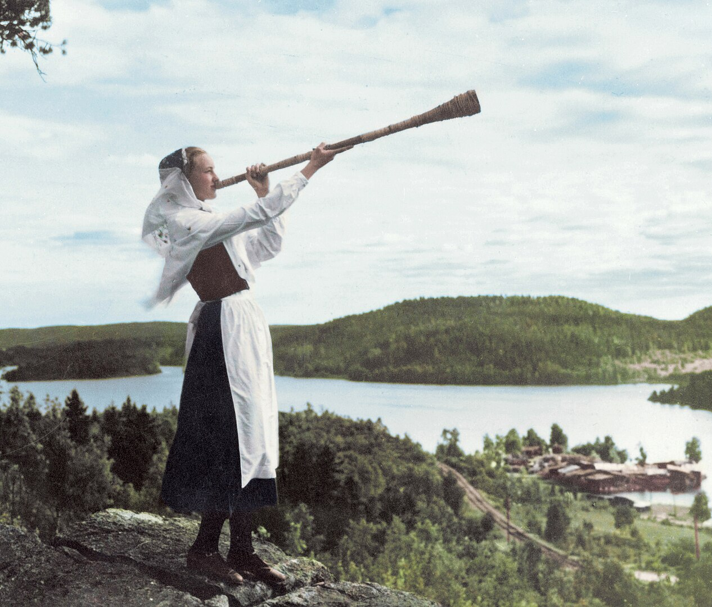

<sub><sup>By <a rel="nofollow" class="external text" href="https://www.flickr.com/people/155661213@N08">Julius Jääskeläinen</a> - <a rel="nofollow" class="external text" href="https://www.flickr.com/photos/juliusjaa/48091219423/">A young Swedish women playing a birch trumpet c.1930.</a>, <a href="https://creativecommons.org/licenses/by/2.0" title="Creative Commons Attribution 2.0">CC BY 2.0</a>, <a href="https://commons.wikimedia.org/w/index.php?curid=98165042">Link</a></sup></sub>

# lur

NixOS on WSL

## Installation

1. Follow [Quick Start](https://github.com/nix-community/NixOS-WSL?tab=readme-ov-file#quick-start) from NixOS-WSL

2. In running NixOS, open a shell with `git`, clone the dotfiles and start the develop shell

```sh
nix-shell -p git
git clone https://github.com/KubqoA/dotfiles.git
sudo mkdir /persist
sudo mv dotfiles /persist/dotfiles
cd /persist/dotfiles
nix develop
```

3. Build the NixOS and home-manager configs

```sh
os lur boot
hm jakub-lur switch
```

4. The configuration changes the default username, so per [NixOS-WSL docs](https://nix-community.github.io/NixOS-WSL/how-to/change-username.html) apply these changes correctly. In PowerShell:

```sh
wsl -t NixOS
wsl -d NixOS --user root exit
wsl -t NixOS
```
