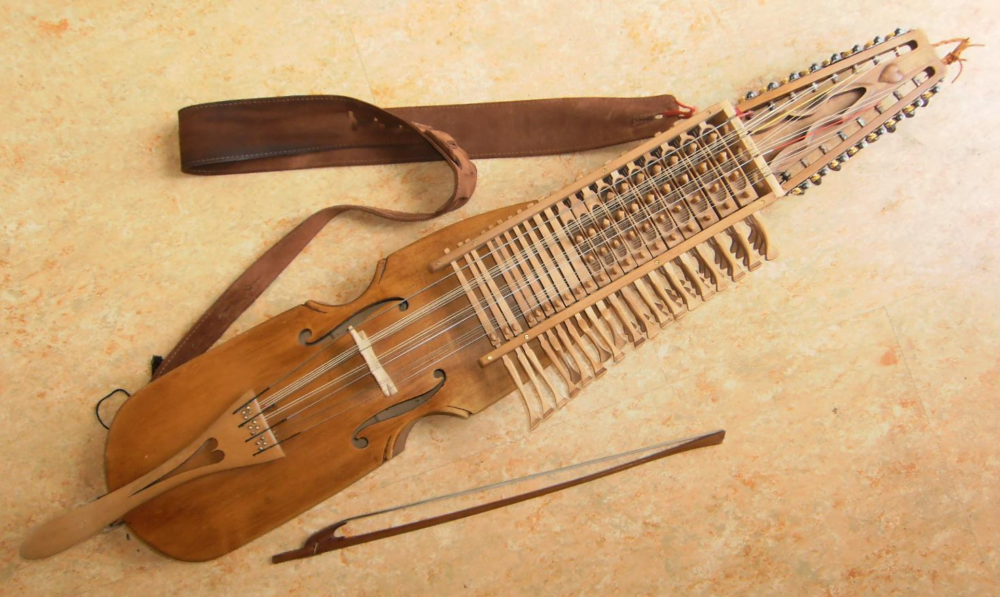

# nyckelharpa

## Setup
1. Install prerequisites - [`nix`](https://nix.dev/install-nix) and [homebrew](https://brew.sh)
```sh
curl -L https://nixos.org/nix/install | sh
/bin/bash -c "$(curl -fsSL https://raw.githubusercontent.com/Homebrew/install/HEAD/install.sh)"
```

2. Clone the repository
```sh
git clone git@github.com:KubqoA/dotfiles.git ~/.config/dotfiles
```

3. Install [`nix-darwin`](https://github.com/LnL7/nix-darwin?tab=readme-ov-file#flakes) and `home-manager`
```sh
nix run nix-darwin -- switch --flake ~/.config/dotfiles
nix run home-manager/master -- switch --flake "~/.config/dotfiles#jakub-macos"
```

4. To apply further updates, run
```sh
dw switch # for darwin-rebuild switch
hm switch # for home-manager switch
```

## Tweaks
### Remap `§` to `` ` ``
Useful for Czech keyboard layout
```sh
sudo hidutil property --set '{"UserKeyMapping":[{"HIDKeyboardModifierMappingSrc":0x700000064,"HIDKeyboardModifierMappingDst":0x700000035}]}'
```

### Faster dock movement from display to display
```sh
defaults write com.apple.dock autohide-delay -float 2; killall Dock
```
